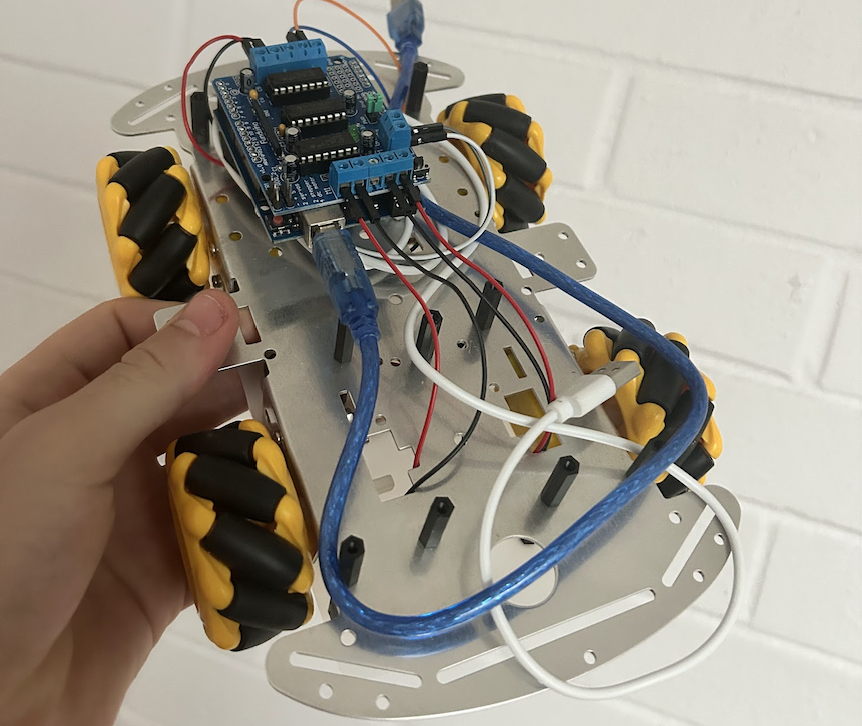

# Robot

include robot.png

This is the repo for my robot project. It will eventually do everything.

SLAM, pathfinding, behaviour trees, speech recogition, object manipulation etc

This repo is organised into Python code for protoyping and c++ code for deploying on hardware.

## Features

Links to robot features:

- [ORB Feature Detection](./robot-child/src/robot_child/orb/main_custom.py)
- [Odometry](./robot-child/src/robot_child/odometry/)
- [Pure Pursuit Path Following](./robot-child/notebooks/sim_tank_vis.ipynb)
- [Behaviour Trees](./robot-child/src/robot_child/behaviour_trees/)
- [Pathfinding](./robot-child/src/robot_child/pathfinding/)
- [Mapping](./robot-child/src/robot_child/mapping/)